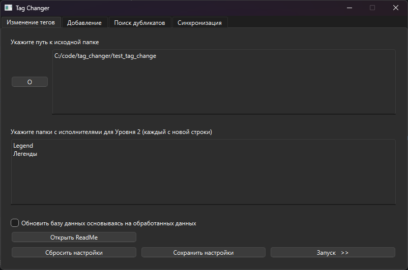
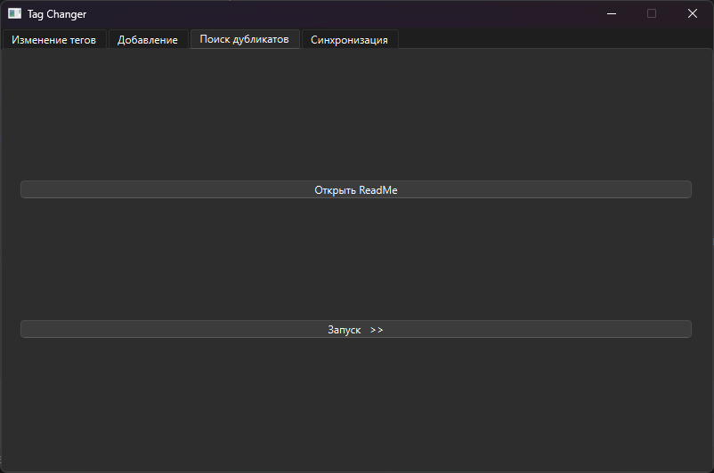
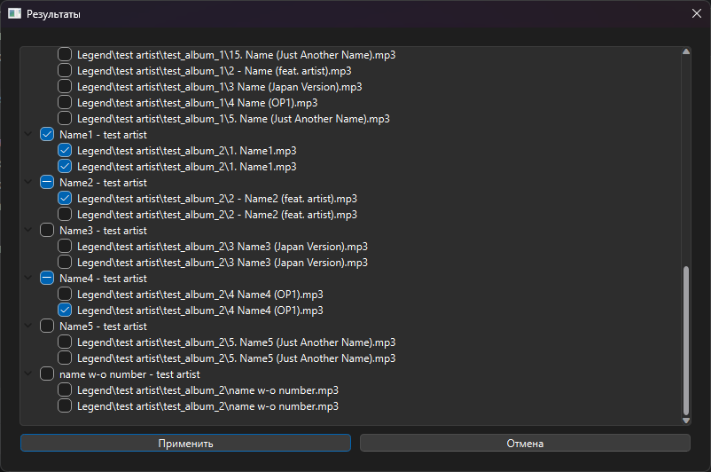

# tag_changer

## Описание

Изменяет теги ID3 теги музыкальных файлов. Изменяет так, как МНЕ было бы удобно (по крайней мере пока), поэтому, если
считаете, что так не удобно, проходите мимо =)

Принцип работы: отсортируйте файлы по папкам, как вам удобно. В зависимости от расположения файла относительно исходной 
папки и его названия, скрипт проставит все необходимые теги (исполнитель, название, альбом), и удалит ненужные (год,
номер дорожки, жанр и д.р.).

Скрипт работает по следующим паттернам:

- Уровень 1 - просто файлы в папках `исходная_папка/папка`. Теги Артист и Название берутся из имени файла, разделённым 
тире с пробелами "Артист - Название". Альбом берётся из названия папки "исходная_папка/Альбом".

- Уровень 2 - `исходная_папка/папка/папка_в_папке`. В зависимости от параметра ARTIST_DIRS возможно 2 возможных поведения:
  - ARTIST_DIRS содержит имя "папки" - "папка_в_папке" становится "папкой_исполнителя". Название берётся из имени файла,
  без разницы в каком формате "Артист - Название" или просто "Название". Артистом становится название
  "папки_исполнителя". Альбомом становится альбом, взятый из уже проставленных ID3 тегов, и файл переносится в
  соответствующую папку (переходит в Уровень 3), если такого тега нет, то создаёт папку "Without Album" и проставляет 
  соответствующий альбом в тегах, перенося песни в эту папку.
  - ARTIST_DIRS не содержит имя "папки" - Теги Артист и Название берутся из имени файла, разделённым тире с пробелами 
  "Артист - Название". Альбом берётся из названия имени папки "исходная_папка/папка/Альбом".

- Уровень 3 - `исходная_папка/папка/папка_в_папке/папка_в_папке_в_папке` (ну не зная я как по другому объяснить, у меня
лапки :crying_cat_face:). Название берётся из имени файла, без разницы в каком формате "Артист - Название" или просто
"Название". Артист берётся из названия "папки_в_папке". Альбом берётся из названия "папки_в_папке_в_папке".

Если в папке на Уровне 2 или 3 есть картинка, или картинка уже есть в первом (по сортировке по имени) файле, она
становится изображением альбома (в последующем, картинка удаляется из каталога), иначе изображение удаляется из тегов.

Если в имени файла есть номер трека по типу "1. Артист - Название", "2 - Артист - Название", "3) Артист - Название" и
т.п. - номер игнорируется, скрипт обрабатывает имя файла как "Артист - Название" (возможны баги, устраняю их по мере
появления новых кейсов). Если в "Названии" есть "мусор в скобках", по типу Limited Edition, Remix, New Version - он
удаляется, если только это не feat, OP или EN (опенинг и ендинг соответственно (да, я анимушник)).

Если в "Артист" указывается несколько исполнителей - первый артист становится "основным", остальные переезжают в 
"Название" в скобку (feat ...).

## Использование

### Общие
1) Установить зависимости для питона\
`pip install -r requirements.txt`
2) Запустить main.py через командную строку (сделать исполняемый файл, или даже exe-ник всё ещё в планах).
3) Можно заново открыть README (или пока что нет), сбросить или сохранить настройки.
4) Если отметить "Обновить базу данных, основываясь на обработанных данных" база данных перезапишется (либо 
создастся новая). Это нужно для поиска дубликатов и в последующем для синхронизации.
5) Настройки сохраняются в файлик settings.txt в корне каталога (на данный момент его нужно создать ручками, перед
первым запуском программы).
6) Пока что запуск с невалидными настройками приводить к разрушению вселенной, так что АСТАНАВИСЬ! ПАДУМОЙ!

### Изменение тегов
1) Пока что не предусмотренно резервное копирование, так что применять лучше не к своей музыкальной библиотеке, а к её 
копии (если что-то пошло не так - я предупредил).
2) Нажать "Запуск >>".
3) Смотреть, как текут логи в консоль.

### Поиск дубликатов
1) Перейти в соответсвующую вкладку, нажать "Запуск >>".
2) Появится окно с результатами, которые основываются на текущей базе данных.
3) Отметить галочкой дубликаты, которые хотите удалить (всё ещё думаю, как лучше: удалить отмеченные, удалить
не отмеченные, сразу все помечать или ещё чего).
4) Нажать "Применить", что бы удалить все отмеченные дубликаты как из базы данных, так и физически (физически результаты
связываются с "Исходной папкой", что должна быть указана во вкладке "Изменение тегов")
5) Если дубликатов не найдено - окно будет пустым.

