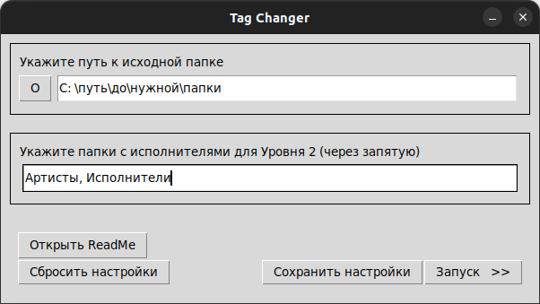

# tag_changer

## Описание

Изменяет теги ID3 теги музыкальных файлов. Изменяет так, как МНЕ было бы удобно (по крайней мере пока), поэтому идите лесом,
если считаете, что так не удобно =)

Принцип работы: отсортируйте файлы по папкам, как вам (мне :smile:) удобно. В зависимости от расположения файла относительно исходной папки и 
его названия, скрипт проставит все необходимые теги (исполнитель, название, альбом), и нафиг удалит ненужные (год, номер дорожки, жанр и д.р.).

Скрипт работает по следующим паттернам:

- Уровень 1 - просто файлы в папках `исходная_папка/папка`. Теги Артист и Название берутся из имени файла, разделённым тире с пробелами 
"Артист - Название". Альбом берётся из названия папки "исходная_папка/Альбом".

- Уровень 2 - `исходная_папка/папка/папка_в_папке`. В зависимости от параметра ARTIST_DIRS возможно 2 возможных поведения:
  - ARTIST_DIRS содержит имя "папки" - "папка_в_папке" становится "папкой_исполнителя". Название берётся из имени файла, без разницы в каком формате
  "Артист - Название" или просто "Название". Артистом становится название "папкой_исполнителя". Альбомом становится альбом, взятый из уже проставленных
  ID3 тегов, и файл переносится в соответствующую папку (переходит в Уровень 3), если такого тега нет... то я ещё не придумал, надо было либо проставлять
  самому, либо сразу пхать в Уровень 3 :sweat_smile:
  - ARTIST_DIRS не содержит имя "папки" - Теги Артист и Название берутся из имени файла, разделённым тире с  пробелами 
  "Артист - Название". Альбом берётся из названия папки "исходная_папка/папка/Альбом".

- Уровень 3 - `исходная_папка/папка/папка_в_папке/папка_в_папке_в_папке` (ну не зная я как по другому объяснить, у меня лапки :crying_cat_face:). Название
берётся из имени файла, без разницы в каком формате "Артист - Название" или просто "Название". Артист берётся из названия "папки_в_папке". Альбом берётся 
из названия "папки_в_папке_в_папке".

Если в папке на Уровне 2 или 3 есть картинка, или картинка уже есть в первом (по сортировке по имени) файле, она становится изображением альбома 
(в последующем картинка удаляется из каталога), иначе изображение удаляется из тегов.

Если в имени файла есть номер трека по типу "1. Артист - Название", "2 - Артист - Название", "3) Артист - Название" и т.п. - номер игнорируется, скрипт
обрабатывает имя файла как "Артист - Название" (возможны баги, устраняю их по мере появления новых кейсов). Если в "Названии" есть "мусор в скобках", типо
Limited Edition, Remix, New Version - удаляется нафиг, если только это не feat, OP или EN (опенинг и ендинг соответсвенно (да, я анимушник)).

Если в "Артист" указывается несколько исполнителей - первый артист становится "основным", остальные переезжают в "Название" в скобку (feaat ...).

## Использование

Установить зависимости для питона

`pip install -r requirements.txt`

### Путь напрямую через командную строку:
1) Прописать в файле teg_changer.py SOURCE_DIR - путь к исходной папке, ARTIST_DIRS - массив с папками исполнителей для Уровеня 2.
2) Запустить teg_changer.py через командную строку.
3) Смотреть на красивые (или не очень) логи.

### Использование простейшего UI:
1) Запустить app.py через командную строку (сделать исполняемый файл, всё ещё в планах).
2) Заполнить поля и нажать "Запуск".
3) Можно заново открыть ридми, сбросить или сохранить настройки.
4) Настройки сохраняются в файлик settings.txt в корне каталога. Файлик создаётся автоматически
после первого запуска программы.
5) Пока что запуск с невалидными настройками приводить к разрушению вселенной, так что АСТАНАВИСЬ! ПАДУМОЙ!
6) Прогресс бар - когда-нибудь сделаю, а пока он всё равно только через консоль работает. Логи там смотри =)

